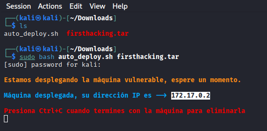
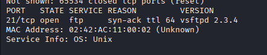
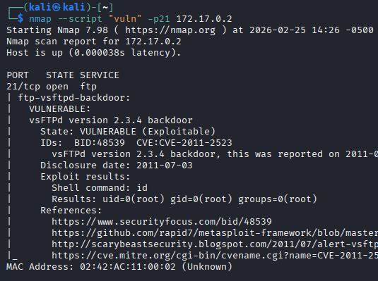
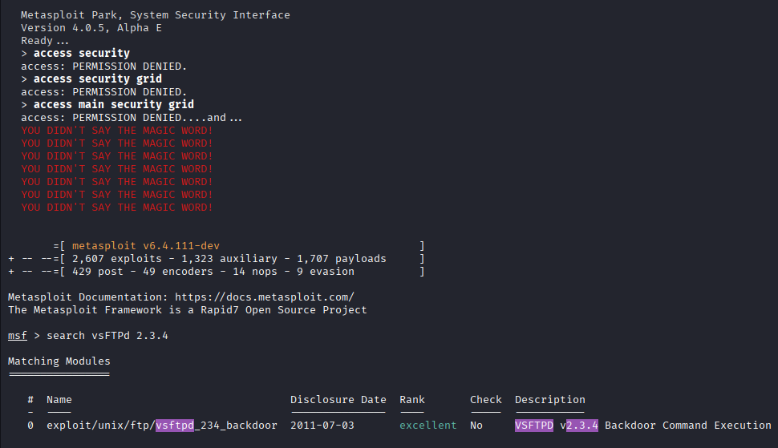
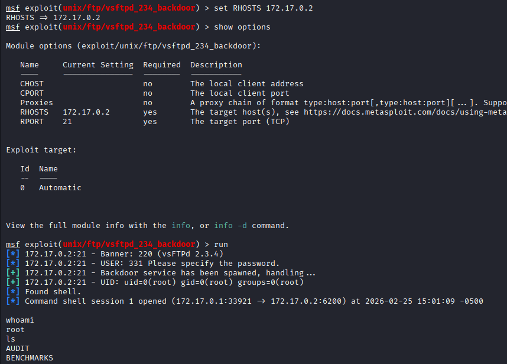

# FirstHacking - DockerLabs

## 📌 Información General

- **Nombre:** FirstHacking  
- **Dificultad:** Muy fácil  
- **Plataforma:** DockerLabs  

---

## 🔎 Enumeración

Se trabaja con la máquina FirstHacking, clasificada como nivel muy facil, perteneciente a DockerLabs.

---

Se realiza un escaneo con Nmap, identificando el puerto 21/TCP abierto, correspondiente al servicio FTP, ejecutando la versión 2.3.4 de vsftpd.

---

## 🚨 Análisis de Vulnerabilidades

Se realiza un escaneo con Nmap utilizando scripts de la categoría vuln sobre el puerto 21 (FTP) para identificar vulnerabilidades conocidas en el servicio expuesto.

El escaneo revela que el servicio en ejecución es vsFTPd 2.3.4, detectado como vulnerable a la backdoor pública asociada al CVE-2011-2523.

Esta vulnerabilidad corresponde a una versión comprometida de vsftpd (v2.3.4), la cual fue distribuida con una puerta trasera maliciosa. Cuando se envía un nombre de usuario especialmente manipulado (que contiene un smiley :)), el servicio abre un shell en el puerto 6200, permitiendo ejecución remota de comandos sin autenticación válida.

El estado reportado por Nmap es VULNERABLE, indicando que el servicio expuesto coincide con la versión afectada públicamente documentada.

---

## 💣 Explotación

Posteriormente, se inicia Metasploit Framework mediante msfconsole para validar y explotar la vulnerabilidad detectada. Dentro de la consola se realiza la búsqueda del módulo correspondiente con search vsftpd 2.3.4, obteniendo como resultado el módulo exploit/unix/ftp/vsftpd_234_backdoor. Se selecciona utilizando su identificador numérico con use 0 (el número puede variar según el orden de los resultados).

---

Una vez cargado el módulo, se configura el parámetro obligatorio set RHOSTS IP_VICTIMA y se ejecuta con run. El exploit aprovecha la vulnerabilidad pública CVE-2011-2523, asociada a la versión comprometida de vsFTPd 2.3.4, la cual contiene una backdoor que permite la apertura de un shell remoto.

Si la explotación es exitosa, se obtiene acceso al sistema objetivo, el cual puede verificarse ejecutando whoami para confirmar el usuario actual. Somos usuario root.

